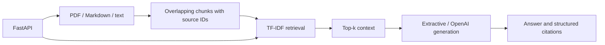

# RAG Knowledge Assistant

> A grounded Retrieval-Augmented Generation (RAG) system with document ingestion, chunking, retrieval evaluation, citations, a FastAPI API, and an optional OpenAI generation layer.

[](https://github.com/pranay-eligeti/rag-knowledge-assistant/actions/workflows/ci.yml)


## What this demonstrates

This project focuses on the engineering around RAG rather than a chat UI alone:

- PDF / Markdown / text ingestion
- deterministic chunking with overlap
- source-aware chunk IDs and citations
- TF-IDF vector retrieval for a zero-network baseline
- optional dense semantic retrieval with sentence-transformers
- retrieval evaluation with Recall@K
- grounded extractive generation by default
- optional OpenAI generation through the Responses API
- FastAPI service with health, ingest, and query endpoints
- tests that exercise retrieval, citations, and the HTTP API

The corpus is synthetic and contains no employer data, PHI, private documents, or credentials.

## Architecture



The shipped `RagService` and API use TF-IDF. `DenseRetriever` is a separate sentence-transformers adapter with normalized embeddings; using it requires the `semantic` extra and application-level wiring. See [`docs/architecture.md`](docs/architecture.md).

The pipeline deliberately separates retrieval from generation so each layer can be evaluated independently.

## Quick start

```bash
python -m venv .venv

# Windows
.venv\Scripts\activate

# macOS/Linux
source .venv/bin/activate

pip install -e ".[dev]"
pytest
```

Run the API:

```bash
uvicorn src.api:app --reload
```

Then:

```bash
curl http://127.0.0.1:8000/health
curl -X POST http://127.0.0.1:8000/ingest
curl -X POST http://127.0.0.1:8000/query \
  -H "Content-Type: application/json" \
  -d '{"question":"What are the stages of a RAG pipeline?","top_k":4}'
```

## Optional semantic retrieval

The default implementation uses deterministic TF-IDF retrieval so CI does not download a model. For a local semantic experiment:

```bash
pip install -e ".[dev,semantic]"
```

Then use `DenseRetriever` from `src.retriever` in an application-specific service configuration.

## Optional LLM generation

Retrieval works without an API key. To enable the OpenAI generation path:

```bash
export OPENAI_API_KEY="..."
export RAG_LLM_MODE=openai
export OPENAI_MODEL=gpt-5.5
```

The code uses `client.responses.create(...)` from the official OpenAI Python library. The default project mode remains extractive so the repository stays testable without external API calls.

## Evaluation

`data/eval/questions.jsonl` contains a small synthetic retrieval evaluation set. The automated test checks Recall@1 against that dataset.

The existing suite checks overlapping chunks, Recall@1 on the synthetic evaluation set, source citations, and the health/query API contract. CI installs the project, compiles `src`, `tests`, and `scripts`, and runs pytest without model calls.

For evaluation of captured answers and retrieval outputs across additional metrics, see the separate [AI Evaluation Harness](https://github.com/pranay-eligeti/ai-evaluation-harness). It is a companion portfolio project, not an automatic integration in this service.

## Validation

```bash
python -m compileall -q src tests scripts
python -m pytest
```

## Implementation scope

The API indexes the local `data/docs` corpus in memory. Citations identify retrieved sources and chunks; they do not independently verify every generated claim. Dense model loading and optional OpenAI generation use external services/downloads only when explicitly selected by the caller.

## API contract

### `GET /health`

Returns service health.

### `POST /ingest`

Loads the local document corpus and builds the retriever.

### `POST /query`

Request:

```json
{"question":"What is the role of dense retrieval embeddings?","top_k":4}
```

Response includes:

```json
{
  "answer": "...",
  "citations": [
    {"source":"retrieval.md","chunk_id":"retrieval.md#chunk-000","score":0.52}
  ],
  "mode":"extractive"
}
```

## Engineering decisions

**Grounding first.** The generation layer only receives retrieved context and is instructed not to invent facts outside that context.

**Citations are structured data.** Sources and chunk IDs are returned alongside the answer, making attribution inspectable by clients and tests.

**Evaluation is part of the repository.** A RAG project is not complete when retrieval “looks good”; the corpus includes a repeatable evaluation dataset and an automated retrieval check.

**Safe defaults.** The public repository uses synthetic documents and no network calls in the default test path.

## Author

**Pranay Eligeti**  
[LinkedIn](https://www.linkedin.com/in/pranay-eligeti) · [GitHub](https://github.com/pranay-eligeti)
